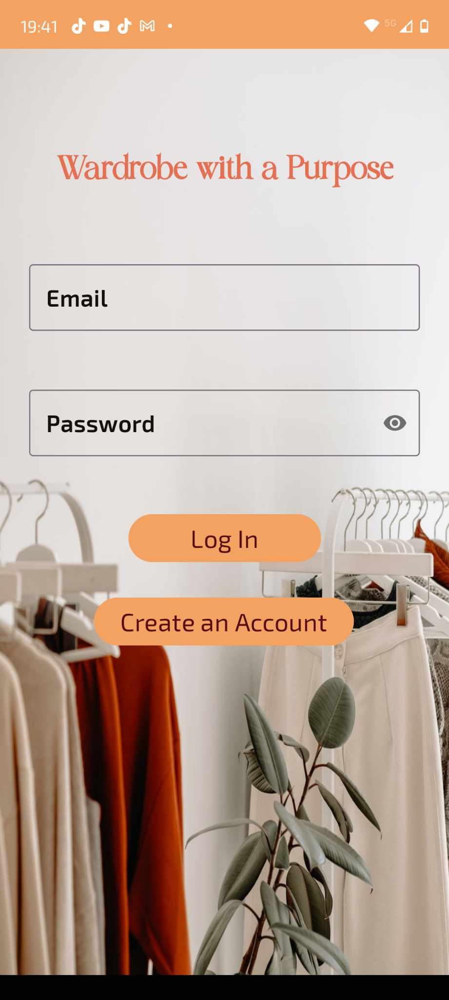
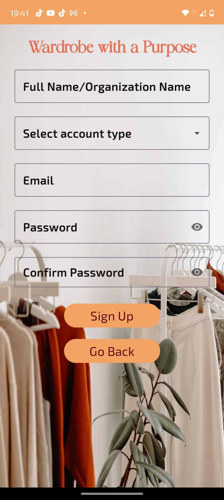
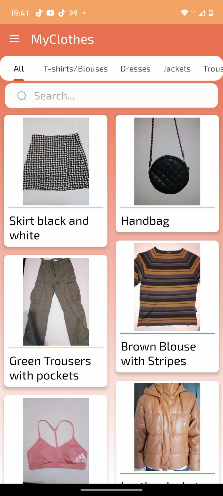
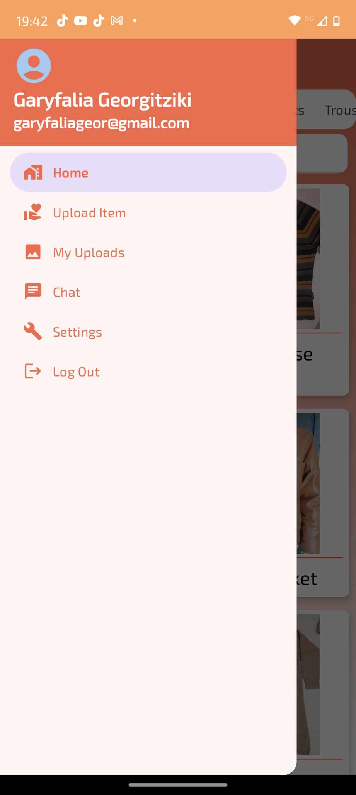
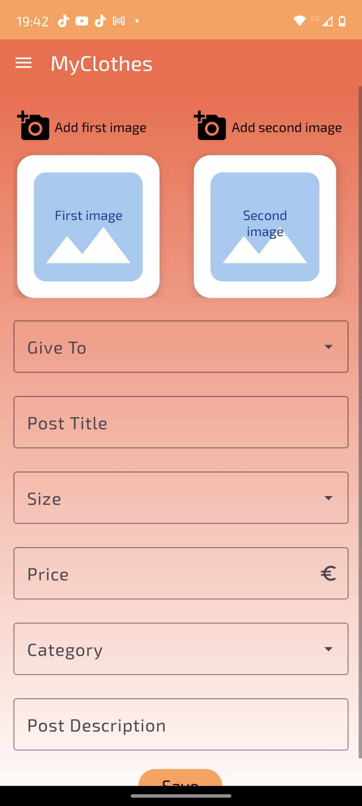
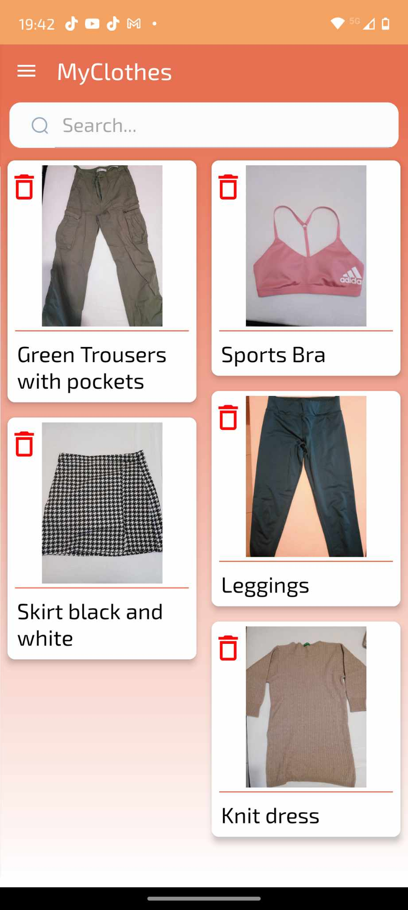
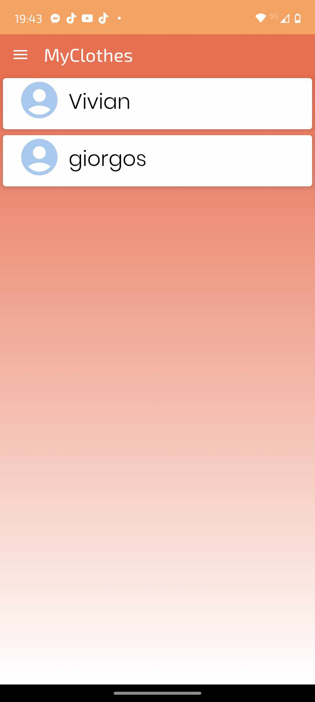
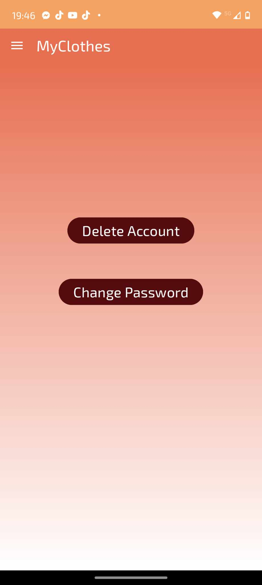

# My Clothes

**My Clothes** is an Android application that allows users to donate or sell their clothes to others within the community. Users can upload their clothing items, interact with other users, and manage their listings through a comprehensive user interface.

## Features

- **User Authentication:** Users can create accounts, log in, and confirm their email addresses through verification links sent to their emails.
- **Product Search:** Users can search for products by category or using a search bar for quick navigation.
- **Product Uploads:** Users can upload product photos, provide descriptions, and list their items under specific categories.
- **Item Management:** Users can view and delete their uploaded items if they are no longer available.
- **Communication:** Users can chat directly with others interested in their products or inquire about other listings.
- **Profile Management:** Users can update their passwords and delete their profiles.

## Technical Description

### Frontend

The application is developed using Kotlin in Android Studio and includes several key activities and fragments:

### Activities

- **Log-In Activity:** Main entry screen where users log in or navigate to sign up.
- **Sign-Up Activity:** Users can create a new account and verify their email addresses.
- **Navigation Drawer Activity:** Central hub for navigating the app, including menu options like Home, Upload Item, My Uploads, Chat, Settings, and Log Out.

### Fragments

- **Home Fragment:** Displays all user-uploaded products with options to filter by categories such as T-Shirts, Dresses, Sportswear, etc.
- **Upload Item Fragment:** Allows users to upload new items with images and details.
- **My Uploads Fragment:** Shows a list of the user's uploaded products with options to delete them.
- **Chat Fragment:** Lists all chats and allows users to communicate with other users.
- **Settings Fragment:** Provides options for changing passwords and deleting the user account.

### Backend

The backend is powered by Firebase, providing:

- **Authentication:** Manages user login data and email verification.
- **Firestore Database:** Stores product and user information across various collections.
- **Storage:** Handles image uploads associated with user products.
- **Realtime Database:** Manages chat data and user interactions in real-time.











## Installation

To run this application, clone the repository and open it in Android Studio:

```bash
git clone https://github.com/yourusername/my-clothes-app.git
